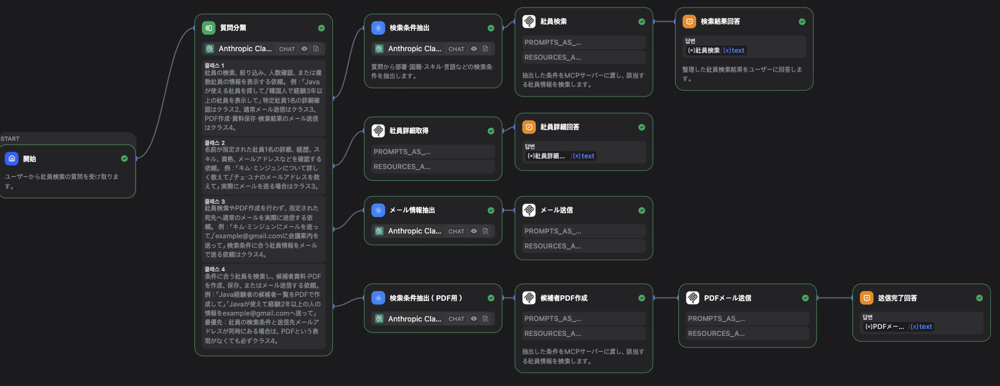
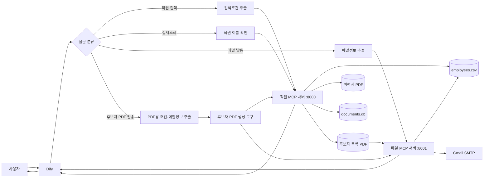

# Dify × MCP 자연어 직원 검색 시스템

사용자가 자연어로 직원·엔지니어를 검색하고, 상세정보와 이력서를 확인하며, 검색된 후보자 목록을 PDF로 만들어 이메일로 보낼 수 있는 업무 지원 프로토타입입니다.

Dify가 질문을 분류하고 검색조건을 추출하면 Python MCP 서버가 CSV 데이터를 검색합니다. 검색 결과는 SQLite에 후보자 자료로 저장할 수 있으며, 일본어 PDF 생성과 Gmail 첨부 전송까지 하나의 요청으로 실행할 수 있습니다. 직원 정보의 추가·수정·삭제는 Claude Desktop과 같은 MCP 클라이언트에서도 실행할 수 있습니다.

> 개인정보, 실제 이력서, Gmail 인증정보는 저장소에 포함하지 않습니다.

## 프로젝트 배경

일본 IT 기업의 인턴 과정에서 파견 업무에 활용할 수 있는 시스템을 주제로 제작한 프로토타입입니다.

거래처가 요구하는 개발 스킬, 언어, 실무경력, 근무 가능 지역 등의 조건에 맞는 엔지니어를 담당자가 자연어로 검색할 수 있도록 구현했습니다. 또한 특정 직원의 상세정보와 이력서를 확인하고, 검색된 후보자 정보를 자료로 저장한 뒤 PDF로 정리하여 담당자에게 메일로 보내는 흐름까지 구성했습니다.

본 저장소에는 회사의 실제 개인정보나 기밀정보를 포함하지 않으며, 포트폴리오 공개 시에는 익명화한 데이터 또는 샘플 데이터를 사용합니다.

## 개발 목적

파견 회사에서는 거래처가 요구하는 기술, 언어, 경력, 근무지역 등의 조건에 맞는 엔지니어를 신속하게 찾아야 합니다. 이 프로젝트는 담당자가 복잡한 검색식을 작성하지 않고 자연어로 인재를 검색할 수 있도록 만들었습니다.

```text
Python 경험이 있고 일본어로 의사소통할 수 있는 직원을 찾아주세요.
```

## 주요 기능

- 부서, 국적, 개발 스킬, 언어, 자격증 조건 검색
- 최소 실무경력, 근무 가능 지역, 참여 가능일 조건 검색
- 여러 스킬의 완전 일치 검색과 부분 일치 결과 안내
- 이전 결과를 활용한 후속 검색
- 특정 직원의 전체 프로필과 이력서 링크 조회
- 직원 정보 추가·조회·수정·삭제(CRUD)
- 직원 이름으로 이메일을 조회한 뒤 Gmail SMTP로 메일 발송
- 검색조건과 후보자 스냅샷을 SQLite에 자료 단위로 저장
- 검색된 후보자 목록을 일본어 PDF로 자동 생성
- 생성된 PDF를 담당자 이메일에 첨부하여 전송
- 직원 검색 MCP와 메일 MCP를 조합한 연속 업무 처리
- MCP Streamable HTTP 지원

## 사용 예시

```text
사용자: Java를 사용할 수 있는 직원을 찾아주세요.
시스템: 조건에 맞는 직원 목록과 일치한 스킬을 표시합니다.

사용자: 그중에서 일본인만 찾아주세요.
시스템: 이전 결과에 국적 조건을 추가해 다시 검색합니다.

사용자: 加藤大輔에 대해 자세히 알려주세요.
시스템: 부서, 업무, 스킬, 언어, 경력 등의 상세정보를 표시합니다.

사용자: 加藤大輔에게 Java 프로젝트가 있다고 메일을 보내주세요.
시스템: 등록된 이메일 주소를 확인한 뒤 메일을 발송합니다.

사용자: Java가 가능하고 경력이 2년 이상인 직원을 검색해 후보자 목록을 PDF로 만들고 담당자 이메일로 보내주세요.
시스템: 조건에 맞는 직원을 검색하고 후보자 자료를 DB에 저장한 뒤, PDF를 생성하여 이메일에 첨부합니다.
```

## 실행 화면

### Dify 워크플로우



### 자연어 직원 검색과 후속 필터링


## 전체 구조



## Dify 워크플로우

| 분류 | 요청 예시 | 처리 과정 |
|---|---|---|
| 클래스 1 | `Python 가능한 사람 찾아줘`, `그 4명 모두 자세히 알려줘` | 조건 추출 → 직원 검색 → 결과 반환 |
| 클래스 2 | `キム・ミンジュン 상세히 알려줘`, `王芳의 이력서 보여줘` | 직원 이름 확인 → 상세조회 |
| 클래스 3 | `加藤大輔에게 메일 보내줘` | 이름·제목·본문 추출 → 메일 발송 |
| 클래스 4 | `Java 경력 2년 이상 후보자를 PDF로 만들어 메일로 보내줘` | 조건 추출 → 검색·DB 저장·PDF 생성 → PDF 첨부 메일 발송 |

Java 검색 요청은 다음 순서로 처리됩니다.

```text
사용자 질문
→ 질문 분류기에서 클래스 1 선택
→ 검색조건 추출기에서 skills = ["Java"] 생성
→ Dify MCP 노드가 search_employee_message 호출
→ 직원 MCP 서버가 employees.csv 검색
→ 검색 결과를 일본어 문장으로 변환
→ Dify가 사용자에게 출력
```

후보자 PDF 발송 요청은 발표와 실제 사용 시 흐름을 단순하게 유지하기 위해 통합 MCP 도구로 처리합니다.

```text
사용자 질문
→ 질문 분류기에서 클래스 4 선택
→ 검색조건·자료 제목·수신자·메일 내용 추출
→ 직원 MCP의 create_candidate_proposal_pdf 호출
→ 조건 검색·SQLite 저장·후보자 PDF 생성
→ 메일 MCP의 send_proposal_email_from_result 호출
→ 생성된 PDF를 Gmail SMTP로 첨부 전송
→ 처리 결과를 사용자에게 출력
```

## 파일별 역할

```text
employee-search-mcp/
├── server.py          # /mcp·/pdf 경로 구성 및 8000번 서버 실행
├── employee_mcp.py    # 여러 파일이 공유하는 직원 MCP 객체 생성
├── employee_tools.py  # Dify·Claude가 호출하는 MCP 도구 등록
├── employee_core.py   # CSV 입출력, 검증, 검색, 결과 형식 처리
├── document_store.py  # 후보자 자료와 스냅샷을 SQLite에 저장
├── proposal_pdf.py    # 저장된 후보자 자료를 일본어 PDF로 생성
├── mail_server.py     # 일반 메일·PDF 첨부 메일 및 8001번 서버 실행
├── employees.csv      # 직원 데이터(저장소에서 제외)
├── documents.db       # 후보자 자료 DB(저장소에서 제외)
├── pdf/               # 이력서 PDF(저장소에서 제외)
├── output/pdf/        # 생성된 후보자 목록 PDF(저장소에서 제외)
├── start_mcp.sh       # tmux 개발환경 일괄 실행
├── pyproject.toml
└── README.md
```

일반 검색 요청 처리 관계:

```text
Dify → server.py → employee_tools.py → employee_core.py → employees.csv
```

후보자 PDF 메일 요청 처리 관계:

```text
Dify
→ 직원 MCP: 검색 → documents.db 저장 → PDF 생성
→ 메일 MCP: 생성된 PDF 확인 → Gmail SMTP 첨부 전송
```

`employee_mcp.py`는 `server.py`와 `employee_tools.py`가 동일한 MCP 서버 객체를 공유하게 합니다. 이를 통해 MCP 객체의 중복 생성과 파일 간 순환 참조를 방지합니다.

## MCP 도구

### 직원 MCP 서버(`8000`)

| 도구 | 역할 |
|---|---|
| `search_employee_message` | 조건 검색 결과를 Dify용 문장으로 반환 |
| `search_employee_data` | 조건 검색 결과를 구조화 데이터로 반환 |
| `get_employee` | 특정 직원 정보 조회 |
| `get_employee_message` | 특정 직원 정보를 문장으로 반환 |
| `get_employee_message_from_query` | 질문에서 직원 이름을 찾아 상세정보 반환 |
| `get_employee_email` | 직원 이메일 주소 반환 |
| `get_resume_file` | 이력서 파일명과 URL 반환 |
| `list_employees` | 전체 직원 목록 조회 |
| `add_employee` | 직원 추가 |
| `update_employee` | 직원 정보 수정 |
| `delete_employee` | 직원 삭제 |
| `create_candidate_proposal` | 검색된 직원 이름 목록을 후보자 자료로 DB에 저장 |
| `get_candidate_proposal` | 자료번호로 저장된 조건과 후보자 정보 조회 |
| `remove_candidate_from_proposal` | 원본 직원정보를 변경하지 않고 자료에서 후보자 제외 |
| `export_candidate_proposal_pdf` | 저장된 후보자 자료번호로 PDF 생성 |
| `create_candidate_proposal_pdf` | 조건 검색·DB 저장·PDF 생성을 한 번에 실행 |

### 메일 MCP 서버(`8001`)

| 도구 | 역할 |
|---|---|
| `send_employee_email` | 직원 이름으로 이메일을 조회하고 메일 발송 |
| `send_proposal_email` | 지정된 후보자 PDF를 담당자 이메일에 첨부 전송 |
| `send_proposal_email_from_result` | 직원 MCP의 PDF 생성 결과를 받아 파일명 추출 없이 첨부 전송 |

## 직원 데이터 구조

`employees.csv`는 다음 열을 사용하며, 복수 값은 `|`로 구분합니다.

| 열 | 내용 | 예시 |
|---|---|---|
| `name` | 이름 | `山田太郎` |
| `department` | 부서 | `開発部` |
| `task` | 담당업무 | `バックエンド開発` |
| `nationality` | 국적 | `日本` |
| `skills` | 개발 스킬 | `Java, Spring Boot, SQL` |
| `languages` | 사용 가능 언어 | `日本語, 英語` |
| `certifications` | 자격증 | `AWS SAA` |
| `experience_years` | 실무경력 | `3` |
| `available_regions` | 근무 가능 지역 | `東京, 神奈川` |
| `available_from` | 참여 가능일 | `2026-09-01` |
| `email` | 이메일 | `taro@example.com` |
| `resume_file` | 이력서 파일명 | `yamada_taro.pdf` |

## 기술 스택

- Python 3.11+
- Dify
- Model Context Protocol(MCP)
- Starlette / Uvicorn
- Claude Desktop
- Gmail SMTP
- SQLite
- ReportLab
- ngrok / Cloudflare Tunnel
- tmux

## 설치 및 실행

### 1. 저장소 복제

```bash
git clone https://github.com/hyoseoknoh/employee-search-mcp.git
cd employee-search-mcp
```

### 2. Python 환경 준비

```bash
uv sync
source .venv/bin/activate
```

### 3. 환경변수 설정

프로젝트 루트에 Git에 올리지 않을 `.env` 파일을 만듭니다.

```env
PUBLIC_BASE_URL=https://your-public-employee-server.example.com
NGROK_HOST=your-public-employee-server.example.com
GMAIL_ADDRESS=your-account@gmail.com
GMAIL_APP_PASSWORD=your-gmail-app-password
```

### 4. 서버 실행

직원 검색 서버:

```bash
python server.py
```

메일 서버(다른 터미널):

```bash
python mail_server.py
```

로컬 MCP 주소:

```text
http://localhost:8000/mcp
http://localhost:8001/mcp
```

### 5. 외부 터널 실행

```bash
ngrok http 8000
```

```bash
cloudflared tunnel --url http://localhost:8001
```

Dify에는 발급된 HTTPS 주소 끝에 `/mcp`를 붙여 입력합니다.

### 6. 개발환경 한 번에 실행

```bash
chmod +x start_mcp.sh
./start_mcp.sh
```

실행 확인:

```bash
tmux list-windows -t mcp
lsof -nP -iTCP:8000 -sTCP:LISTEN
lsof -nP -iTCP:8001 -sTCP:LISTEN
```

## 보안 및 개인정보 보호

다음 항목은 `.gitignore`로 저장소에서 제외합니다.

```text
.env
.venv/
employees.csv
pdf/
dify/
documents.db
documents.db-*
output/pdf/
```

- 실제 직원 이름, 이메일, 이력서는 공개하지 않습니다.
- Gmail 일반 비밀번호 대신 앱 비밀번호를 사용합니다.
- 공개 데모에는 익명화한 샘플 데이터만 사용합니다.
- 운영 환경에서는 MCP 서버 인증과 사용자 권한 관리가 필요합니다.

## 한계 및 향후 개선

현재 버전은 기능 검증을 위한 로컬 프로토타입입니다.

- CSV를 MySQL 또는 PostgreSQL로 전환
- MCP 서버를 클라우드 환경에 배포
- 임시 터널 대신 고정 도메인 사용
- 생성된 PDF를 로컬 파일 대신 인증된 스토리지에서 관리
- 사용자 인증과 역할별 접근권한 추가
- 직원 이름 대신 고유 ID를 사용해 동명이인 처리
- 이메일 발송 전 사용자 확인 단계 추가
- 자동 테스트 및 배포 파이프라인 구축

## 프로젝트에서 배운 점

- 자연어를 구조화된 검색조건으로 변환하는 방법
- Dify 워크플로우와 MCP 도구의 역할 분리
- 하나의 MCP 서버에 여러 업무 도구를 등록하는 방법
- 여러 MCP 서버를 조합해 검색·문서 생성·메일 전송을 연결하는 방법
- SQLite에 검색 당시 후보자 정보를 스냅샷으로 저장하는 방법
- 일본어 글꼴을 포함한 PDF 생성과 첨부파일 검증 방법
- 데이터 검색 로직과 사용자 출력 로직을 분리하는 방법
- 로컬 서버를 외부 AI 서비스와 연결할 때 필요한 보안 고려사항

## License

학습 및 포트폴리오 목적으로 제작한 프로젝트입니다.
